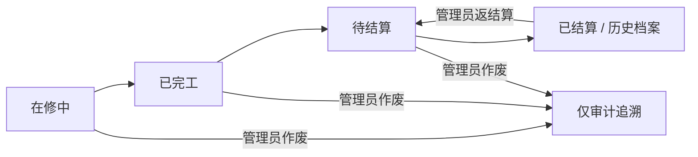

# Android 完整业务能力设计

## 1. 背景与决策

Android 客户端已经完成品牌登录、加密会话恢复、公司隔离 Room 缓存、真实工作台、五栏 Navigation 3 壳层以及只读工单列表与详情。当前仍缺少新增、编辑、状态推进、结算、返结算、作废、到账回执、历史档案、导出、后台读取同步与正式 Release 发布能力。

用户确认采用“纵向业务切片、逐阶段上线”方案：Android 最终覆盖员工与管理员完整业务能力，但不把全部风险集中到一次大版本。继续复用现有 Cloudflare Functions、D1、腾讯云 COS、操作日志和网页端业务规则，不建设第二套移动后端。

所有写操作必须在线完成。离线允许浏览公司隔离缓存和编辑本地加密草稿，但不自动排队、重放或提交业务写入。

## 2. 目标

- 员工可在 Android 新增、编辑未结算工单，并推进至“待结算”。
- 管理员可完成结算、返结算、作废和到账回执维护。
- 已结算工单自动进入维修历史，返结算后返回当前工单。
- “档案”同时承载维修历史、客户车辆和保险档案。
- 所有移动端写入继续由服务端校验身份、企业、角色、权限、状态和并发版本。
- 多端同时操作时不静默覆盖，重复点击或重试不产生重复业务事件。
- 敏感数据最小化缓存，回执图片和短期授权 URL 不落地持久化。
- 每个里程碑独立具备代码、测试、文档、Git 提交、GitHub 推送和可安装 APK。
- 最终完成正式图标、版本号、Release 签名、升级和真实设备验收。

## 3. 非目标

- 不实现离线写入队列或自动提交草稿。
- 不在 Android 保存密码、回执文件、COS 签名 URL 或长期明文 Token。
- 不复制网页端全部桌面报表、系统管理和批量导入界面；只实现移动业务闭环所需的字典、档案、导出和账户能力。
- 不替换现有 Cloudflare、D1、COS 或操作日志基础设施。
- 不允许客户端隐藏按钮替代服务端权限校验。
- 不在生产企业数据上执行自动写入测试。

## 4. 权限与状态基线

### 4.1 员工

- 查看当前工单、已结算历史、客户车辆和保险档案。
- 创建工单。
- 编辑未结算、未作废工单。
- 只能按相邻步骤向前推进：`在修中 -> 已完工 -> 待结算`；不能跳级或回退。
- 不可结算、返结算、作废、维护到账回执或导出。
- 不可编辑已结算历史档案。

### 4.2 管理员

- 拥有员工全部能力。
- 可在普通维修状态中向前推进或退回相邻一步；不能跳级，也不能用普通状态接口产生“已结算”。
- 可结算待结算工单。
- 可返结算已结算工单。
- 可作废未作废工单。
- 可查看、补传、替换和删除到账回执。
- 可修正已结算档案中的非状态字段。
- 可导出当前筛选结果。

### 4.3 状态流转

员工只能在普通状态范围内向前推进一个相邻步骤，不能跳级、回退或产生“已结算”“作废”。管理员可在 `在修中 <-> 已完工 <-> 待结算` 中向前或向后移动一个相邻步骤，但仍须服务端验证角色、目标状态和工单当前版本。已结算状态只能由独立结算命令产生；历史编辑不能直接修改状态。

### 4.4 能力枚举

现有 `AppPermission` 扩展为稳定的客户端能力边界：

- `VIEW_ORDERS`、`CREATE_ORDER`、`EDIT_ORDER`、`ADVANCE_ORDER_STATUS`；
- `SETTLE_ORDER`、`REVERSE_SETTLEMENT`、`VOID_ORDER`、`MAINTAIN_RECEIPT`；
- `VIEW_RECORDS`、`MANAGE_RECORDS`、`EXPORT_DATA`。

员工拥有查看、创建、编辑、向前推进和查看档案能力；管理员在此基础上拥有结算、返结算、作废、回执维护、档案管理和导出能力。界面可根据 `BusinessCapability` 隐藏或禁用入口，但服务端必须依据会话中的角色和企业重新授权，不能信任客户端枚举值。

## 5. 总体架构

### 5.1 领域层

新增清晰的领域模型与命令，不继续扩张当前只读 `RepairOrder`：

- `OrderSummary`：列表、工作台、筛选和离线浏览字段。
- `OrderDetail`：完整业务字段和当前版本。
- `OrderDraft`：新增或编辑中的表单草稿。
- `OrderStatusTransition`：允许的状态变化与原因。
- `SettlementDraft`：结算日期、时间、备注和回执选择结果。
- `OrderCommandResult`：成功、校验失败、权限拒绝、冲突、未知结果等稳定结果。
- `BusinessCapability`：服务端下发的企业/角色功能开关。

字段校验、状态机、金额计算、权限决策和错误映射保持为纯 Kotlin 逻辑，使 Compose 不承载业务判断。

### 5.2 数据层

- 继续由认证仓库提供当前内存会话与 Bearer Token。
- 读仓库继续缓存优先、联网刷新和公司隔离。
- 写仓库只接受明确命令，统一添加 `operationId`、`expectedVersion`、Token 和企业身份。
- Room 负责摘要、完整详情的允许缓存字段、同步游标和草稿索引。
- Android Keystore 支持手机号、VIN、COS 对象键等字段级 AES-GCM 加密。
- 密码、回执二进制和短期下载 URL 不写入 Room。
- WorkManager 只执行满足网络和有效会话条件的读取同步，不执行后台写入。

### 5.3 功能层

- `ui/orderform`：新增/编辑四步向导。
- `ui/orderstatus`：普通状态推进与确认。
- `ui/records`：维修历史、客户车辆和保险档案。
- `ui/settlement`：管理员结算。
- `ui/receipts`：回执查看与维护。
- `ui/orderadmin`：返结算、作废和档案修正。
- `ui/export`：管理员筛选结果导出与系统分享。
- `ui/profile`：账户、同步、草稿和版本信息。

每个功能拥有独立 ViewModel、UI 状态和窄仓库接口，不能直接访问 Retrofit、Room DAO 或会话存储。

### 5.4 导航层

保留 `工作台 / 工单 / 新增 / 档案 / 我的` 五栏和每栏独立返回栈。详情、编辑、结算、回执和管理确认均使用类型安全路由。退出或会话失效销毁整个会话级 ViewModelStore，清除敏感页面状态。

## 6. 数据模型与本地存储

### 6.1 完整工单字段

Android 完整模型至少覆盖现有服务端字段：

- 标识：工单号、企业 ID、版本、创建/更新时间。
- 接待：日期、时间、客户、手机号、业务员。
- 车辆：车牌、车型、VIN。
- 保险：保险到期、保险公司和现有事故/保险字段。
- 维修：工单类型、维修记录、状态、预计交车。
- 费用：工时费、材料费、总金额，内部统一使用分为单位的 `Long`。
- 结算：结算日期、时间、备注、回执元数据。
- 作废：作废标记、时间和原因。

金额不能使用浮点数参与 Android 业务计算。服务端兼容当前数字格式，但 API 规范化响应应提供整数分值或精确十进制字符串。

### 6.2 Room

- `order_summaries`：当前与历史列表需要的摘要。
- `order_details`：允许离线读取的完整详情；敏感列写入前加密。
- `order_drafts`：草稿元数据和加密表单载荷。
- `sync_cursors`：按企业和资源保存增量游标。
- 客户车辆与保险档案使用独立公司隔离表，不把任意 JSON 直接泄露给 UI。

Room 升级必须提供显式 Migration、迁移测试和回滚说明，不允许开发阶段依赖破坏性重建。退出、401、换企业和无有效恢复会话时继续通过 `AuthenticatedDataCleaner` 清理全部身份数据。

### 6.3 草稿

- 草稿以本地 UUID 标识，创建成功后再关联服务端正式工单号。
- 保存草稿不代表提交成功。
- 离线可保存、恢复和删除草稿。
- 恢复网络后不自动提交；用户重新检查最新字段并主动确认。
- 编辑草稿记录起始 `expectedVersion`，提交前若服务器版本变化则进入冲突处理。

## 7. API 与 D1 演进

### 7.1 兼容策略

网页端和 Windows 客户端当前依赖既有 `/api/orders` 与 `/api/receipts`。新实现保留旧接口响应兼容，同时把核心规则抽到共享服务函数，新增语义明确的命令端点。不能复制两份状态机或权限逻辑。

未携带 `scope`、游标和增量参数的旧 `GET /api/orders` 必须维持既有返回结构与筛选语义；Android 新客户端才使用扩展参数。旧客户端创建时可继续提交既有工单号字段，新 Android 创建流程不提交正式工单号，由服务端生成并返回。兼容层只负责请求/响应转换，最终仍调用同一套校验、权限、状态和审计服务。

### 7.2 读取接口

- `GET /api/orders?scope=current|history&cursor=...&updatedAfter=...`
- `GET /api/orders/{id}`
- `GET /api/dictionaries`
- 继续使用客户车辆、保险档案和操作日志接口。

`scope=current` 只返回未作废的“在修中 / 已完工 / 待结算”；`scope=history` 只返回已结算且未作废记录。历史使用游标分页，读取同步支持增量游标。响应包含服务器时间、下一游标和数据版本。

### 7.3 写入接口

- `POST /api/orders`：创建；服务端生成正式工单号并返回规范化工单。
- `PATCH /api/orders/{id}`：编辑普通字段。
- `POST /api/orders/{id}/status`：普通状态变化。
- `POST /api/orders/{id}/settle`：回执上传与结算协调。
- `POST /api/orders/{id}/reverse-settlement`：返结算。
- `POST /api/orders/{id}/void`：作废。
- `GET/POST/DELETE /api/receipts`：查看、补传、替换和删除回执。
- 档案、客户车辆、保险档案和导出继续复用或细化现有端点。

所有写请求必须携带：

- `operationId`：客户端生成的 UUID，作为幂等键和审计关联键。
- `expectedVersion`：客户端最后看到的工单版本。
- Bearer Token。
- 由服务端从会话解析的企业与角色；客户端提交的企业/角色不能作为授权依据。

### 7.4 并发控制

D1 `repair_orders` 增加 `version INTEGER NOT NULL DEFAULT 1`，每次成功写入递增。更新 SQL 必须包含 `WHERE company_id = ? AND id = ? AND version = ?`。没有命中返回 `409 ORDER_VERSION_CONFLICT`，并携带最新安全工单快照或刷新标记。

Android 不静默合并冲突。界面显示服务器最新值、用户草稿和发生变化的字段，允许用户取消或基于新版本重新编辑。结算、返结算、作废和状态变化必须重新确认，不能自动重放。

### 7.5 幂等与未知结果

服务端保存 `operationId`、企业、动作、目标、结果摘要和完成状态。同一企业、用户、动作和 `operationId` 重复请求返回原结果，不重复写入或重复审计。

客户端超时但不知道服务端是否完成时，先查询操作结果或刷新目标工单，再决定是否允许重试。不能把“连接中断”等同于“写入失败”。

## 8. 业务流程

### 8.1 新增工单

四步向导：

1. 客户与车辆：客户、手机号、车牌、车型、VIN、业务员。
2. 保险与事故：保险到期、保险公司及现有事故字段。
3. 维修与费用：类型、维修记录、工时费、材料费、预计交车。
4. 确认提交：汇总、校验、网络、权限和重复提交检查。

服务端生成正式工单号，忽略客户端伪造企业、角色、结算和作废字段。创建成功后删除本地草稿，写入 Room，并进入详情页。

### 8.2 编辑与普通状态推进

- 员工可编辑未结算且未作废工单。
- 员工可在“在修中 / 已完工 / 待结算”范围内按批准规则推进。
- 管理员可执行批准的普通状态调整。
- 已结算工单只能通过历史档案修正非状态字段。
- 所有状态变化使用独立确认界面和服务端状态机，不能作为普通编辑字段提交。

### 8.3 结算

管理员结算前必须满足：在线、权限允许、状态为“待结算”、版本一致、回执文件合法。

流程：

1. 填写结算日期、时间和备注。
2. 通过系统文件选择器选择 JPEG、PNG 或 WebP。
3. 本地校验 MIME、文件头、大小和可读性。
4. 服务端上传私有 COS 对象并写入回执元数据。
5. D1 版本化更新工单为“已结算”。
6. 写入单一“完成结算”主审计事件，回执上传作为内部步骤。
7. Android 刷新当前与历史缓存，详情进入对应历史栈。

COS 与 D1 无法跨系统原子提交。若 D1 更新失败，服务端删除本次新对象；删除失败记录待清理对象和告警，但不得把工单误标为已结算。相同 `operationId` 重试返回相同结果。

### 8.4 回执维护

- 查看使用短期授权 URL，不把 URL 或文件持久化。
- 管理员可对已结算或待结算工单补传/替换回执。
- 替换先成功写入新对象和元数据，再删除旧对象，避免先删后失败。
- 删除必须二次确认并写入独立审计事件。
- 员工不显示维护按钮，服务端同样返回 403。

### 8.5 返结算与作废

返结算仅管理员可执行，必须二次确认。状态恢复为“待结算”，清空结算日期、时间和备注；原回执及历史审计保留，避免丢失财务证据。返结算后工单从历史移回当前列表。

作废仅管理员可执行，必须输入原因并二次确认。作废记录不显示在当前或历史日常列表，但 D1 记录与操作日志永久保留用于追溯。

### 8.6 档案与导出

“档案”包含：

- 已结算维修历史；
- 客户车辆；
- 保险档案。

维修历史支持结算日期、进厂日期、车牌、客户、手机号、保险公司、车型和业务员筛选。员工只读；管理员可修正非状态字段、维护回执、返结算和导出。

导出只允许管理员在线执行。优先由服务端生成当前筛选结果的 CSV/XLSX 或可分享文件，避免 Android 在内存中加载全部历史。导出文件写入应用缓存目录，通过系统分享表单发送，并按时间清理。

## 9. 页面与交互

### 9.1 工作台

- 最近工单进入真实详情。
- 员工快捷操作进入新增或状态推进。
- 管理员额外显示待结算入口、结算提醒和经营指标。
- 所有快捷操作进入实际目标页面，不以 Snackbar 代替功能。

### 9.2 工单

- 根列表只展示未结算工单。
- 保留本地搜索、固定状态筛选、同步/陈旧/离线/空状态。
- 详情根据权限和状态显示编辑、推进、结算、作废等操作。
- 离线保留内容，隐藏或禁用写入口并显示统一原因。
- 版本冲突显示服务器最新数据、草稿差异与“重新编辑”。

### 9.3 新增与编辑

- 使用四步向导和底部固定操作区。
- 支持上一步、保存草稿、下一步和确认提交。
- 错误定位到具体步骤和字段。
- 离开未保存内容前确认。
- 重选“新增”根标签时询问继续草稿或放弃，不直接清空。
- 键盘、返回手势和进程恢复不能丢失已保存草稿。

### 9.4 档案

顶部分为维修历史、客户车辆、保险档案三个页签。每个页签拥有独立筛选与返回栈。历史详情复用工单详情组件，但权限操作由档案上下文决定。

### 9.5 结算与管理操作

结算使用独立全屏流程。返结算、作废、回执替换/删除使用明确的风险确认组件，展示工单号、车牌、影响和不可逆范围。提交期间禁止重复点击；结果未知时不立即恢复按钮为可提交状态，而是先查询结果。

### 9.6 通用交互

- 触控目标至少 48dp。
- 覆盖默认、按下、加载、禁用、错误、冲突和成功状态。
- 使用现有品牌 Token、圆角、间距、浅色科技风格和本地 Hugeicons。
- 支持 360dp 宽度、大字体、横屏、键盘避让、返回手势和屏幕阅读器。
- 表单标签、错误、金额、状态和风险操作不能仅用颜色表达。

## 10. 错误处理

| 类别 | Android 行为 |
| --- | --- |
| 400 字段错误 | 映射到具体字段或步骤，保留草稿 |
| 401 会话失效 | 先清身份缓存，再返回登录并显示过期原因 |
| 403 权限不足 | 显示权限原因并刷新会话能力，不伪装为网络错误 |
| 404 不存在 | 详情进入失效态；回执显示不存在 |
| 409 版本冲突 | 展示最新记录和草稿差异，要求重新确认 |
| 413 文件过大 | 保留结算草稿，要求重新选择文件 |
| 415 文件类型错误 | 明确允许的格式，不开始上传 |
| 429 操作过频 | 使用服务端 Retry-After 提示重试时间 |
| 5xx/网络异常 | 保留缓存和草稿；写入结果未知时查询 operationId |
| 协程取消 | 继续向上传播，不转换成业务失败 |

所有仓库错误必须转换为密封领域结果，Compose 不解析 HTTP 状态码或服务端字符串。

## 11. 安全、隐私与审计

- TLS 是唯一允许的生产传输方式。
- Android 交互门禁不替代 Cloudflare 服务端授权。
- Token 使用现有 Keystore 加密会话；密码不持久化。
- 手机号、VIN、COS 对象键等敏感缓存字段使用 Keystore 支持的字段级加密。
- 回执对象保持 COS 私有，读取使用短期授权 URL。
- 上传同时验证扩展名、声明 MIME、文件头和大小。
- 日志、崩溃报告和测试输出不得记录 Token、密码、手机号、VIN、COS 签名 URL 或图片内容。
- 每次业务写入产生一个主审计事件；内部步骤通过相同 `operationId` 关联。
- 服务端能力开关可按企业、角色和功能逐步启用高风险能力。
- 能力关闭时 Android 自动降级为只读或隐藏入口，不伪造成功。

## 12. 后台读取同步

- 仅在有效会话、系统验证网络和能力允许时运行。
- 使用企业与资源维度的增量游标。
- 当前工单、历史、客户车辆、保险档案分别同步，失败互不污染。
- 进程重启后恢复游标，但不能恢复或自动重放业务写命令。
- 用户主动刷新优先，后台同步使用唯一工作避免并发风暴。
- 注销、401 或换企业时取消对应 WorkManager 工作并清理游标。

## 13. 测试策略

### 13.1 Cloudflare 与网页端

- 权限矩阵：员工、管理员、跨企业和过期会话。
- 字段校验、状态机、版本冲突和幂等。
- 创建、编辑、状态、结算、返结算和作废审计。
- COS 上传、查看、替换、删除和失败补偿。
- current/history 分流、游标分页和增量同步。
- 新 API 对现有网页端和 Windows 客户端的兼容回归。

### 13.2 Android JVM

- 完整模型与金额映射。
- 四步表单验证和草稿恢复。
- 状态机与权限门禁。
- 幂等请求、冲突和未知结果协调。
- ViewModel 状态、会话切换和取消传播。
- 敏感字段加密/解密失败处理。

### 13.3 Room 与 Android 测试源码

- 显式 Migration 和公司隔离。
- 摘要、详情、草稿和游标 DAO。
- 退出、401、换身份清理。
- Compose 表单、确认、文件选择、冲突、禁用、48dp、无障碍和导航契约。
- 按用户要求常规开发不启动模拟器；编译 Android 测试代码，并由用户在真实手机执行验收。

### 13.4 写入冒烟

写接口上线前使用独立测试企业和可清理数据完成真实 API 冒烟。自动化不得对生产业务企业执行创建、结算、返结算或作废。

### 13.5 每阶段构建门禁

- Cloudflare/网页端单元测试与生产构建。
- Android JVM 测试。
- Android 测试 Kotlin 编译。
- `lintDebug`。
- Debug APK 构建、哈希和签名验证。
- 更新真机清单、接力文档、Git 提交和 GitHub 推送。

## 14. 八阶段交付

### 阶段 1：完整模型、存储与 API 基础

- 完整领域模型、错误结果和状态机。
- D1 `version`、operation 幂等记录和共享命令服务。
- Room Migration、敏感字段加密、草稿与同步游标。
- current/history 读取契约与服务端能力开关。

### 阶段 2：新增工单

- 四步向导、字典、草稿、创建 API 和正式工单号。
- 工作台与“新增”根标签接入真实流程。

### 阶段 3：编辑与普通状态推进

- 编辑未结算工单。
- 员工状态推进、管理员普通状态调整。
- 版本冲突和未知结果处理。

### 阶段 4：档案中心

- 维修历史分页、筛选、详情。
- 客户车辆和保险档案。
- 员工只读与管理员非状态字段修正。

### 阶段 5：管理员结算

- 文件选择、回执上传、结算协调、COS 补偿。
- 结算后自动从当前移入历史。

### 阶段 6：高风险管理

- 返结算、作废。
- 回执查看、补传、替换和删除。
- 风险确认与审计展示。

### 阶段 7：导出、账户与后台读取同步

- 管理员筛选结果导出和系统分享。
- 草稿、同步、版本与账户信息。
- WorkManager 增量读取同步。

### 阶段 8：正式发布

- 正式应用图标、版本号、Release 密钥和渠道配置。
- Release 构建、签名、升级、回滚和隐私检查。
- 完整真实手机验收与发布清单。

阶段顺序不可把结算提前到版本控制、幂等和完整模型之前。每阶段可通过服务端能力开关独立回滚到安全只读状态。

本文件是完整业务能力的主设计规格，不直接生成一个跨越八阶段的巨型实施清单。用户批准本规格后，先使用 `writing-plans` 为阶段 1 生成可逐项验证的任务级计划；阶段 2 至阶段 8 在前一阶段验收后分别生成独立计划。若某阶段引入本规格未覆盖的新业务选择或 UI 决策，必须先补充该阶段设计并再次确认，不能在实现中临时扩张范围。

## 15. 验收标准

- 员工可完成新增、编辑和推进至待结算，且无法越权结算。
- 管理员可完成结算、返结算、作废和回执维护。
- 已结算与返结算在当前/历史之间正确移动。
- 客户车辆、保险档案和历史查询具备真实数据、筛选和详情。
- 离线只读与草稿保存正常，恢复网络后不自动提交。
- 重复点击、超时重试和多端冲突不会重复写入或静默覆盖。
- 401、跨企业、权限不足、COS 失败和补偿均有测试证据。
- 敏感数据、日志和临时文件符合本设计的最小化规则。
- Android、网页端和 Cloudflare 验证通过；未执行的连接式测试明确记录。
- 每阶段 APK 可安装、哈希一致、签名有效，并完成用户真机验收。
- 最终 Release 使用正式签名，不以 Debug APK 作为生产发布包。
